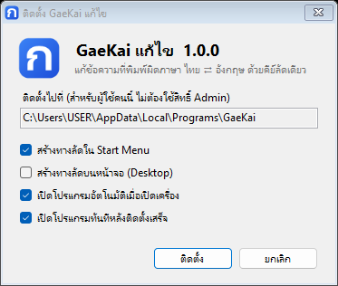
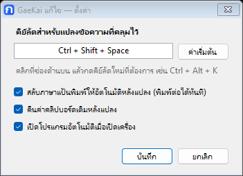

# GaeKai (แก้ไข) — แก้ข้อความที่พิมพ์ผิดภาษา ไทย ⇄ English

ลืมกดเปลี่ยนภาษาก่อนพิมพ์? แค่ **คลุมข้อความ** แล้วกด **`Ctrl + Shift + Space`** ข้อความจะถูกแก้เป็นภาษาที่ตั้งใจพิมพ์ทันที

ใช้ได้ทั้ง **Windows** และ **macOS** (ดู [ส่วนของ macOS](#macos)) · ดู [สิ่งที่เปลี่ยนแปลงในแต่ละเวอร์ชัน](CHANGELOG.md)

| พิมพ์ผิดเป็น | กดคีย์ลัดแล้วได้ |
|---|---|
| `l;ylfu;yoouh;yo0yomiN` | สวัสดีวันนี้วันจันทร์ |
| `เนนก ทนพืรืเ` | good morning |
| `py',u ฺีเ vp^j =j;p9i;0lv[.shsojvp` | ยังมี Bug อยู่ ช่วยตรวจสอบให้หน่อย |

## ความสามารถ

- **แปลงได้ทั้งสองทาง** ไทย → อังกฤษ และ อังกฤษ → ไทย โดยเดาทิศทางให้อัตโนมัติ
- **แก้ข้อความที่ผิดสลับกันได้ในครั้งเดียว** เช่น ประโยคไทยที่มีคำอังกฤษปน แต่ทุกคำพิมพ์ผิดแป้น
- **แปลงเฉพาะข้อความที่คลุมไว้** ใช้ได้กับเกือบทุกโปรแกรม เช่น Word, Excel, Chrome, LINE, Notepad
- **สลับภาษาแป้นพิมพ์ให้อัตโนมัติหลังแปลง** เป็นภาษาของคำสุดท้าย พิมพ์ต่อได้เลยโดยไม่ต้องกดเปลี่ยนภาษาเอง
- **คืนค่าคลิปบอร์ดเดิม** สิ่งที่คัดลอกไว้ก่อนหน้าไม่หาย และไม่ทิ้งขยะไว้ใน Clipboard History (Win + V)
- **เปลี่ยนคีย์ลัดได้** ตามต้องการ
- **เปิดอัตโนมัติเมื่อเปิดเครื่อง**
- ตัวโปรแกรมเป็นไฟล์เดียว ขนาดประมาณ 150 KB ไม่ต้องติดตั้งอะไรเพิ่ม ไม่ต้องใช้สิทธิ์ Admin ไม่ต่ออินเทอร์เน็ต และไม่เก็บข้อมูลใดๆ

## ดาวน์โหลดและติดตั้ง

ใช้ได้กับ Windows 10 และ 11 (ใช้ .NET Framework 4.8 ที่มากับ Windows อยู่แล้ว)

### แบบติดตั้ง (แนะนำ)

1. ดาวน์โหลด **`GaeKai-Setup.exe`** จากหน้า [Releases](../../releases/latest)
2. ดับเบิลคลิก แล้วกด **ติดตั้ง**



- ติดตั้งให้เฉพาะผู้ใช้คนนี้ที่ `%LOCALAPPDATA%\Programs\GaeKai` **ไม่ต้องใช้สิทธิ์ Admin**
- มีทางลัดใน Start Menu (พิมพ์ค้นหา "GaeKai" หรือ "แก้ไข" ได้) และเปิดอัตโนมัติเมื่อเปิดเครื่อง
- **อัปเดต:** ดาวน์โหลดตัวติดตั้งเวอร์ชันใหม่มาติดตั้งทับได้เลย ตัวติดตั้งจะปิดตัวเก่าให้เอง และการตั้งค่าเดิมยังอยู่ครบ
- ติดตั้งแบบเงียบ (สำหรับผู้ดูแลระบบ): `GaeKai-Setup.exe /S`

### แบบพกพา (ไม่ต้องติดตั้ง)

1. ดาวน์โหลด **`GaeKai.exe`** จากหน้า [Releases](../../releases/latest)
2. ย้ายไฟล์ไปไว้ในที่ถาวร (ไม่ควรเก็บไว้ใน Downloads เพราะ Windows จะเปิดโปรแกรมจากตำแหน่งนี้ทุกครั้งที่เปิดเครื่อง)
3. ดับเบิลคลิกเพื่อเปิด ครั้งแรกที่เปิด โปรแกรมจะตั้งให้เปิดอัตโนมัติพร้อม Windows ให้เลย

เมื่อเปิดแล้ว จะมีไอคอน **ก** สีน้ำเงินขึ้นที่ถาดไอคอนมุมขวาล่าง (ข้างนาฬิกา)

> **Windows ขึ้นว่า "Windows protected your PC"?** เป็นเพราะโปรแกรมยังไม่ได้ซื้อใบรับรองเซ็นดิจิทัล
> ให้กด **More info → Run anyway** (ซอร์สโค้ดทั้งหมดอยู่ใน repo นี้ ตรวจสอบได้)

## วิธีใช้

1. คลุม (เลือก) ข้อความที่พิมพ์ผิดภาษา
2. กด `Ctrl + Shift + Space`

โปรแกรมจะแบ่งข้อความเป็นช่วงๆ ตามชนิดตัวอักษร ช่วงที่เป็นตัวอักษรอังกฤษจะแปลงเป็นไทย ช่วงที่เป็นอักษรไทยจะแปลงเป็นอังกฤษ
จึงแก้ประโยคที่ผิดสลับกันได้ในครั้งเดียว ถ้าคลุมเกินไปโดนคำที่พิมพ์ถูกอยู่แล้ว (เช่น `l;ylfu ครับ`)
โปรแกรมจะพยายามเก็บคำที่ถูกไว้ตามเดิม (ได้ `สวัสดี ครับ`) แต่เพื่อความแม่นยำ ควรคลุมเฉพาะส่วนที่พิมพ์ผิด

หลังแปลง แป้นพิมพ์จะถูกสลับเป็นภาษาของคำสุดท้ายให้เอง (ปิดได้ในหน้าตั้งค่า)
ถ้าแปลงออกมาไม่ถูกใจ คลุมแล้วกดซ้ำอีกครั้งเพื่อสลับกลับ

## เปลี่ยนคีย์ลัดและตั้งค่า

ดับเบิลคลิกที่ไอคอน **ก** หรือคลิกขวาแล้วเลือก **ตั้งค่า / เปลี่ยนคีย์ลัด...**
(ถ้าหาไอคอนไม่เจอ ให้เปิด `GaeKai.exe` ซ้ำอีกครั้ง หน้าตั้งค่าจะเปิดขึ้นมาเอง)



คลิกที่ช่องคีย์ลัดแล้วกดปุ่มที่ต้องการ เช่น `Ctrl + Alt + K` ต้องมีปุ่ม Ctrl / Alt / Shift / Win อย่างน้อย 1 ปุ่ม
(ยกเว้น F1–F24, Pause, ScrollLock ที่ใช้เดี่ยวๆ ได้) ถ้าคีย์ลัดไปชนกับโปรแกรมอื่น โปรแกรมจะแจ้งให้เลือกใหม่

**เมนูเมื่อคลิกขวาที่ไอคอน**

| เมนู | ทำอะไร |
|---|---|
| ตั้งค่า / เปลี่ยนคีย์ลัด... | เปิดหน้าตั้งค่า |
| หยุดชั่วคราว | ปิดคีย์ลัดไว้ก่อน ไอคอนจะเป็นสีเทา (เช่น ตอนเล่นเกม) |
| เปิดอัตโนมัติเมื่อเปิดเครื่อง | เปิด/ปิดการเริ่มทำงานพร้อม Windows |
| วิธีใช้ / เกี่ยวกับ | วิธีใช้และเวอร์ชันของโปรแกรม |
| ออกจากโปรแกรม | ปิดโปรแกรม |

การตั้งค่าเก็บไว้ที่ `%APPDATA%\GaeKai\settings.ini` แก้ด้วยมือได้:

```ini
Hotkey=Ctrl + Shift + Space
SwitchKeyboardLayout=true
RestoreClipboard=true
Paused=false
```

## ข้อจำกัดที่ควรรู้

- รองรับแป้นไทย **เกษมณี** (ค่าเริ่มต้นของ Windows) เท่านั้น ยังไม่รองรับแป้นปัตตะโชติ
- **โปรแกรมที่เปิดด้วยสิทธิ์ Administrator:** Windows ไม่อนุญาตให้โปรแกรมสิทธิ์ปกติส่งปุ่มเข้าไป
  ถ้าต้องใช้กับโปรแกรมแบบนี้ ต้องเปิด GaeKai ด้วย *Run as administrator* ด้วย
- **Terminal / Command Prompt:** ในโปรแกรมพวกนี้ Ctrl + C หมายถึงหยุดคำสั่ง จึงใช้ GaeKai ไม่ได้
- ใช้ได้เฉพาะโปรแกรมที่คัดลอกและวางด้วย Ctrl + C / Ctrl + V
- คีย์ลัดที่ตั้งไว้จะใช้แทนคีย์ลัดเดียวกันของโปรแกรมอื่น (เช่น `Ctrl + Shift + Space` ใน Excel คือเลือกทั้งหมด) ถ้าต้องการใช้ปุ่มนั้นในโปรแกรมอื่น ให้เปลี่ยนคีย์ลัดของ GaeKai
- โปรแกรมเขียนโค้ดบางตัวจะคัดลอกทั้งบรรทัดเมื่อกด Ctrl + C โดยไม่ได้คลุมข้อความ VS Code และ Visual Studio ตรวจจับให้แล้ว
  แต่ใน JetBrains (IntelliJ, PyCharm ฯลฯ) ต้องคลุมข้อความก่อนกดคีย์ลัดเสมอ
- แอนตี้ไวรัสบางตัวอาจเตือน เพราะโปรแกรมใช้คีย์ลัดที่ทำงานได้ทุกหน้าต่างและจำลองการกดปุ่ม ซึ่งเป็นวิธีการทำงานปกติของโปรแกรมประเภทนี้

## ถอนการติดตั้ง

**ถ้าติดตั้งด้วย `GaeKai-Setup.exe`:** ไปที่ **Settings → Apps → Installed apps** ค้นหา **GaeKai แก้ไข** แล้วกด **Uninstall**
โปรแกรมจะถูกปิด และลบไฟล์ ทางลัด การตั้งค่า และการเปิดพร้อม Windows ออกทั้งหมด

**ถ้าใช้แบบพกพา:**

1. คลิกขวาที่ไอคอน **ก** แล้วเอาเครื่องหมายถูกที่ **เปิดอัตโนมัติเมื่อเปิดเครื่อง** ออก
2. เลือก **ออกจากโปรแกรม**
3. ลบไฟล์ `GaeKai.exe` และโฟลเดอร์ `%APPDATA%\GaeKai`

---

## macOS

ใช้ได้กับ macOS 13 (Ventura) ขึ้นไป ทั้งเครื่อง Apple Silicon (M1 ขึ้นไป) และ Intel

### ติดตั้ง

1. ดาวน์โหลด **`GaeKai-mac.dmg`** จากหน้า [Releases](../../releases/latest)
2. เปิดไฟล์ แล้วลาก **GaeKai** ไปใส่โฟลเดอร์ **Applications**
3. เปิด GaeKai จาก Applications ครั้งแรก macOS จะไม่ยอมเปิด เพราะโปรแกรมยังไม่ได้ลงทะเบียนกับ Apple
   ให้ไปที่ **System Settings → Privacy & Security** เลื่อนลงไปแล้วกด **Open Anyway**
4. **อนุญาตสิทธิ์ Accessibility:** โปรแกรมจะพาไปที่ **System Settings → Privacy & Security → Accessibility**
   ให้เปิดสวิตช์ที่ **GaeKai** (ต้องมีสิทธิ์นี้ GaeKai จึงจะกด ⌘C / ⌘V แทนคุณได้)

เมื่อเปิดแล้ว จะมีไอคอน **ก** ขึ้นที่แถบเมนูด้านบนของจอ ถ้าไอคอนเป็นสีจาง แปลว่ายังไม่ได้รับสิทธิ์ หรือหยุดชั่วคราวอยู่

### วิธีใช้

เหมือนบน Windows: คลุมข้อความที่พิมพ์ผิดภาษา แล้วกด **`⌃⇧Space`** (Control + Shift + Space)
เปลี่ยนคีย์ลัดได้ที่เมนู **ตั้งค่า / เปลี่ยนคีย์ลัด...** หรือเปิด GaeKai จาก Applications ซ้ำอีกครั้ง

การตั้งค่าเก็บไว้ที่ `~/Library/Application Support/GaeKai/settings.ini` ในรูปแบบเดียวกับ Windows
ส่วนชื่อปุ่มกดร่วมใช้ `Ctrl`, `Option`, `Shift`, `Cmd` เช่น `Hotkey=Ctrl + Option + K`

### ต่างจาก Windows อย่างไร

- **ใช้แป้นพิมพ์ที่คุณเปิดไว้จริง** โปรแกรมอ่านตำแหน่งปุ่มจากแป้นไทยและแป้นอังกฤษใน
  **System Settings → Keyboard → Input Sources** จึงรองรับทั้ง **เกษมณีและปัตตะโชติ** (และแป้นอังกฤษแบบ Dvorak ฯลฯ)
  ถ้ายังไม่ได้เพิ่มแป้นไทยไว้ จะใช้แป้นเกษมณีเป็นค่าเริ่มต้น
- แป้นเกษมณีของ macOS ต่างจากของ Windows 2 ปุ่ม: ปุ่ม `` ` `` ได้ `-` และปุ่ม `3` ได้ `_` (Windows สลับกัน) GaeKai แปลงตามแป้นของ macOS
- เปิดอัตโนมัติเมื่อเปิดเครื่องผ่าน **Login Items** (ดูได้ที่ System Settings → General → Login Items)
- คลิปบอร์ดที่คืนค่าจะถูกติดป้ายไว้ไม่ให้โปรแกรมจัดการคลิปบอร์ด (Maccy, Raycast, Alfred, Paste ฯลฯ) บันทึกซ้ำ

### ข้อจำกัดบน macOS

- **อัปเดตเป็นเวอร์ชันใหม่แล้ว คีย์ลัดไม่ทำงาน?** เพราะ macOS จำสิทธิ์ Accessibility ไว้กับตัวโปรแกรมแต่ละเวอร์ชัน
  ให้ไปที่ Privacy & Security → Accessibility เลือก GaeKai แล้วกดปุ่ม **−** เพื่อลบออก จากนั้นเปิด GaeKai แล้วอนุญาตใหม่
- ใช้กับช่องรหัสผ่านไม่ได้ (macOS ไม่อนุญาตให้โปรแกรมอื่นส่งปุ่มเข้าไป)
- ใน Terminal ใช้ได้ (Terminal ใช้ ⌘C / ⌘V) แต่ข้อความที่วางจะต่อท้ายบรรทัดคำสั่ง ไม่ได้แทนที่ข้อความเดิม
- คีย์ลัดที่ตั้งไว้จะใช้แทนคีย์ลัดเดียวกันของโปรแกรมอื่น ถ้าชนกับคีย์ลัดของ macOS เอง (เช่น ⌃Space ที่ใช้สลับภาษา) ให้เลือกคีย์ลัดอื่น
- ใน VS Code ตรวจจับการคัดลอกทั้งบรรทัดให้แล้ว แต่ใน JetBrains ต้องคลุมข้อความก่อนกดคีย์ลัดเสมอ

### ถอนการติดตั้ง

1. คลิกที่ไอคอน **ก** แล้วเลือก **ออกจากโปรแกรม**
2. ลาก **GaeKai** จาก Applications ไปที่ถังขยะ
3. ลบโฟลเดอร์ `~/Library/Application Support/GaeKai`
4. ลบ GaeKai ออกจาก System Settings → Privacy & Security → Accessibility (ถ้าต้องการ)

---

## สำหรับนักพัฒนา

### Build

ใช้แค่ Windows 10/11 ไม่ต้องติดตั้ง Visual Studio หรือ .NET SDK เพราะสคริปต์ใช้ C# compiler ที่มากับ Windows

```bat
build.bat          :: สร้าง dist\GaeKai.exe และตัวติดตั้ง dist\GaeKai-Setup.exe
build.bat test     :: รันชุดทดสอบ
build.bat icon     :: สร้าง src\GaeKai.ico ใหม่
```

เนื่องจาก compiler ที่มากับ Windows รองรับถึง C# 5 โค้ดทั้งหมดจึงเขียนด้วย C# 5
(ห้ามใช้ `$"..."`, `?.`, `nameof`, `=>` แบบ expression-bodied member เป็นต้น)

### Build บน macOS

ต้องมี Xcode หรือ Command Line Tools (`xcode-select --install`) โค้ดอยู่ในโฟลเดอร์ `mac/` เขียนด้วย Swift + AppKit

```bash
mac/build.sh          # สร้าง dist/GaeKai.app และ dist/GaeKai-mac.dmg (Universal: Apple Silicon + Intel)
mac/build.sh test     # รันชุดทดสอบ
mac/build.sh icon     # สร้าง mac/Resources/GaeKai.icns ใหม่
```

ตัวโปรแกรมเซ็นแบบ ad-hoc เท่านั้น (ไม่ใช่ Developer ID) ทุกครั้งที่ build ใหม่ macOS จะมองเป็นโปรแกรมคนละตัว
ต้องลบ GaeKai ออกจากรายการ Accessibility แล้วอนุญาตใหม่

### หลักการทำงาน

1. ลงทะเบียนคีย์ลัดกับ Windows ด้วย `RegisterHotKey`
2. เมื่อกดคีย์ลัด รอให้ผู้ใช้ปล่อยปุ่มก่อน (ไม่อย่างนั้น Ctrl + C จะกลายเป็น Ctrl + Shift + C)
3. สำรองคลิปบอร์ดเดิมไว้ แล้วจำลองการกด Ctrl + C ด้วย `SendInput`
4. รอดูว่าคลิปบอร์ดเปลี่ยนไหม (`GetClipboardSequenceNumber`) ถ้าไม่เปลี่ยนแปลว่าไม่ได้คลุมข้อความ ก็หยุดแค่นั้น
5. แบ่งข้อความเป็นช่วงตามชนิดตัวอักษร (ไทย / อังกฤษ) แล้วแปลงแต่ละช่วงไปอีกภาษาทีละตัวอักษรตามตำแหน่งปุ่ม
   (US QWERTY ⇄ เกษมณี) ยกเว้นช่วงที่อ่านได้ถูกต้องอยู่แล้วและจะอ่านไม่ออกถ้าแปลง
   (ตรวจไทยด้วยหลักการวางสระ/วรรณยุกต์ ตรวจอังกฤษด้วยสัญลักษณ์ที่ไม่ควรอยู่กลางคำ เช่น `;` `[` `'`)
6. ใส่ข้อความใหม่ลงคลิปบอร์ด แล้วจำลองการกด Ctrl + V
7. สลับภาษาแป้นพิมพ์เป็นภาษาของคำสุดท้าย ด้วย `WM_INPUTLANGCHANGEREQUEST` ที่ส่งไปยังช่องที่กำลังพิมพ์ (`GetGUIThreadInfo`)
8. รอ 400 ms ให้โปรแกรมปลายทางวางเสร็จ แล้วคืนค่าคลิปบอร์ดเดิม

บน macOS ขั้นตอนเหมือนกัน แต่ใช้ `RegisterEventHotKey` รับคีย์ลัด, `CGEvent` จำลองการกด ⌘C / ⌘V,
`NSPasteboard.changeCount` ดูว่าคลิปบอร์ดเปลี่ยนไหม, `UCKeyTranslate` อ่านตำแหน่งปุ่มจากแป้นที่ผู้ใช้เปิดไว้
และ `TISSelectInputSource` สลับภาษาแป้นพิมพ์

### โครงสร้างโปรเจกต์

| ไฟล์ | หน้าที่ |
|---|---|
| `src/LayoutConverter.cs` | ตารางแป้นพิมพ์และการแปลงข้อความ |
| `src/TextSwapper.cs` | ขั้นตอนคัดลอก → แปลง → วาง และการสลับภาษาแป้นพิมพ์ |
| `src/ClipboardHelper.cs` | สำรอง/คืนค่าคลิปบอร์ดด้วย Win32 API |
| `src/Hotkey.cs`, `src/HotkeyBox.cs` | รูปแบบคีย์ลัด และช่องสำหรับกดคีย์ลัด |
| `src/MessageWindow.cs` | หน้าต่างที่มองไม่เห็น ใช้รับคีย์ลัด |
| `src/TrayApp.cs`, `src/SettingsForm.cs` | ไอคอนที่ถาดไอคอน เมนู และหน้าตั้งค่า |
| `src/AppSettings.cs`, `src/StartupManager.cs` | ไฟล์ตั้งค่า และการเปิดพร้อม Windows (`HKCU\...\Run`) |
| `src/InstallLayout.cs` | ตำแหน่งติดตั้งและ Registry ที่ตัวโปรแกรมกับตัวติดตั้งใช้ร่วมกัน |
| `src/Uninstaller.cs` | ถอนการติดตั้ง (`GaeKai.exe --uninstall`) |
| `installer/` | ตัวติดตั้ง `GaeKai-Setup.exe` (ฝัง `GaeKai.exe` ไว้ข้างใน) |
| `tests/Tests.cs` | ชุดทดสอบ |
| `tools/IconGen.cs` | สร้างไฟล์ไอคอน |
| `mac/Sources/LayoutConverter.swift`, `mac/Sources/KeyboardLayouts.swift` | (macOS) ตารางแป้นพิมพ์ การอ่านแป้นที่ผู้ใช้เปิดไว้ และการสลับภาษา |
| `mac/Sources/TextSwapper.swift`, `mac/Sources/Clipboard.swift` | (macOS) ขั้นตอนคัดลอก → แปลง → วาง และการสำรอง/คืนค่าคลิปบอร์ด |
| `mac/Sources/Hotkey.swift`, `mac/Sources/HotkeyCenter.swift`, `mac/Sources/HotkeyField.swift` | (macOS) รูปแบบคีย์ลัด การลงทะเบียนคีย์ลัด และช่องสำหรับกดคีย์ลัด |
| `mac/Sources/App.swift`, `mac/Sources/SettingsWindow.swift` | (macOS) ไอคอนที่แถบเมนู เมนู และหน้าตั้งค่า |
| `mac/Sources/AppSettings.swift`, `mac/Sources/LoginItem.swift`, `mac/Sources/Permissions.swift` | (macOS) ไฟล์ตั้งค่า การเปิดพร้อมเครื่อง และสิทธิ์ Accessibility |
| `mac/tests/Tests.swift`, `mac/tools/IconGen.swift` | (macOS) ชุดทดสอบ และสร้างไฟล์ไอคอน |

### ออกเวอร์ชันใหม่

```bash
git tag v1.0.0
git push origin v1.0.0
```

GitHub Actions จะรันชุดทดสอบ, build, ใส่เลขเวอร์ชันตาม tag ให้ตัวโปรแกรมและตัวติดตั้ง
แล้วแนบ `GaeKai-Setup.exe`, `GaeKai.exe` และ `GaeKai-mac.dmg` ไว้ในหน้า Releases ให้อัตโนมัติ

## License

[MIT](LICENSE)

---

### English

**GaeKai** is a tiny Windows tray app that fixes text typed with the wrong keyboard layout (Thai Kedmanee ⇄ US QWERTY).
Select the text, press **Ctrl + Shift + Space**, and `l;ylfu` becomes `สวัสดี` (or `เนนก` becomes `good`).
The direction is detected automatically, the keyboard layout is switched for you, and your clipboard is restored afterwards.
The hotkey is configurable, and the app starts with Windows. It's a single ~150 KB exe with no dependencies beyond the .NET Framework 4.8 built into Windows 10/11.
Download `GaeKai-Setup.exe` (per-user installer, no admin rights needed) or the portable `GaeKai.exe` from [Releases](../../releases/latest), or build both with `build.bat`.

**macOS (13+):** a native menu bar app lives in `mac/`. Download `GaeKai-mac.dmg`, drag GaeKai to Applications, and grant it Accessibility access (needed to send ⌘C / ⌘V).
It reads the Thai and English layouts you have enabled, so both Kedmanee and Pattachote work. Build with `mac/build.sh` (needs the Xcode Command Line Tools).
